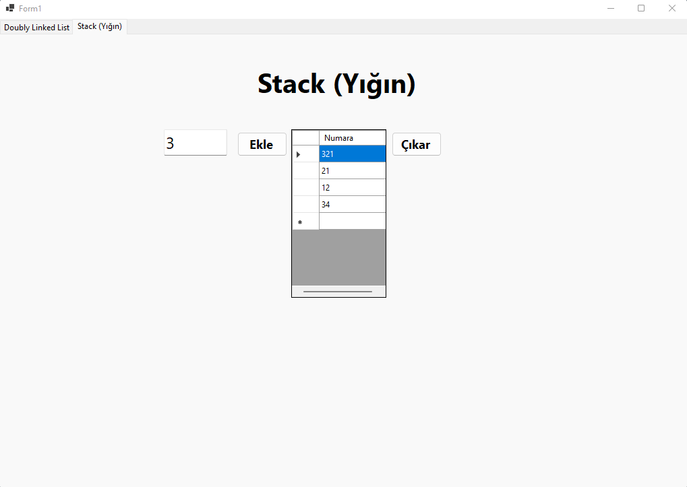
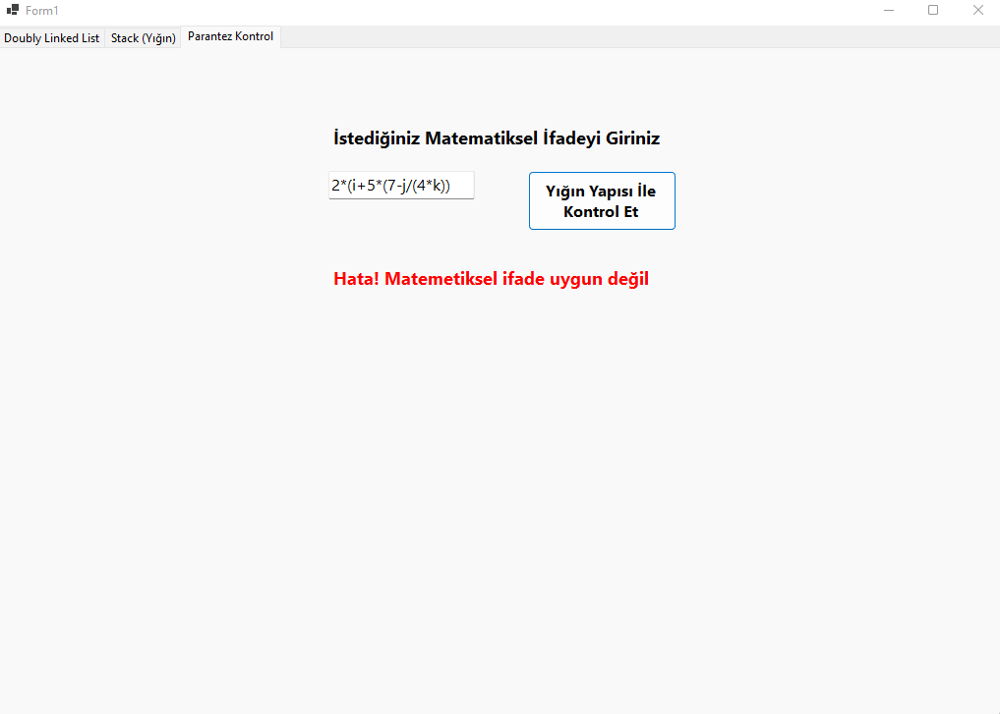

# Data Structure

### Doubly Linked List (Çift Yönlü Bağlı Liste)

### Stack (Yığın)

### Parenthesis check in math expression (Matematik İfadede Parantez Kontrolu)
Burada girilen matematik bir ifadenin parantazlerinin doğru girilip girilmediğini kontrol eden bir kontrol yapısı,
bunu yaparken arkada bir de kendi oluşturduğumuz bir yığın(stack) yapısını kullanarak yapıyoruz.

